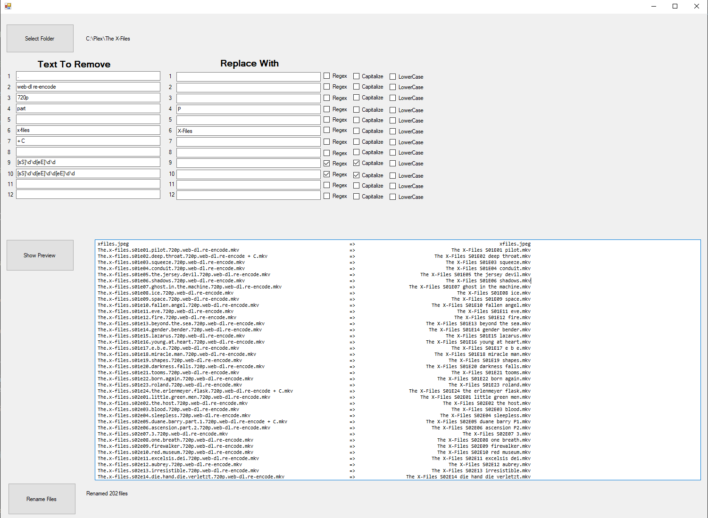

# plex-file-renamer
plex-file-renamer

Work in progress

This project watches a folder and automatically renames files within that folder.

Apparently nobody else has this problem, for me plex doesn't like a lot of the garbage file names I give it and will simply not display them unless I fix it.

  